<h1>
  <div align="center">
    <b>CLINIC MANAGEMENT SYSTEM</b>
  </div>
</h1>

<p align="center">
  
</p>

## ***Member list:***

- 17035 Nguyen Hoang Hai Nam
- 17273 Truong Hoang Nam
- 17306 Tran Minh Ngoc
- 18810 Tran Kim Hoan

***Lecturer:*** Dr. Tran Hong Ngoc

## ***Part 1: System Requirement***

- Install Visual Studio Code with Extension Pack for Java, JDK, MySQL (you can use another text editors or IDE likes Eclipse, NetBeans but in this instruction we will demonstrate using VSCode)

## ***Part 2: Installation Step***

- Step 1: Create new folder, open this new folder in VSCode, open terminal and clone the project

```lang-non
  git clone <https://github.com/Requiem5032/java-project>
```

- Step 2: Open MySQL, click the plus sign to create a new connection

<p align="center">
  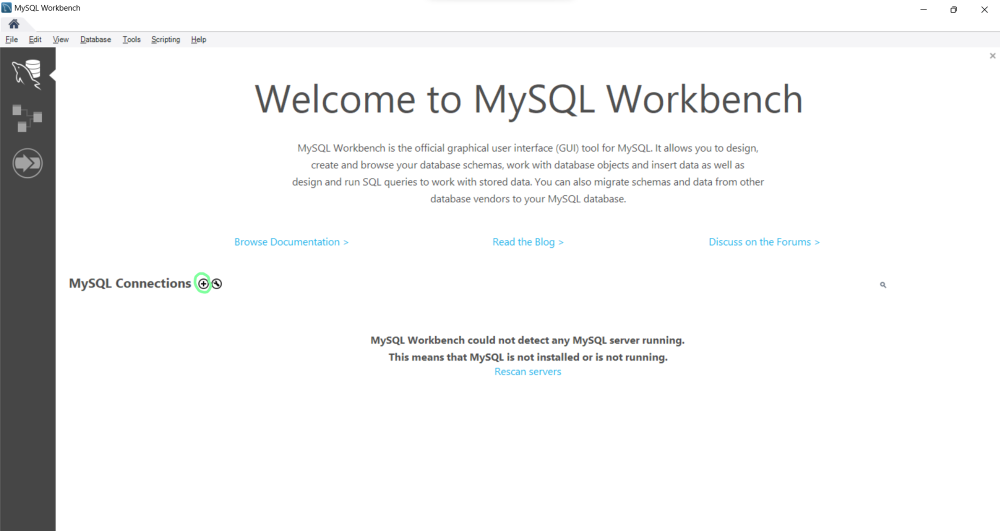
</p>

- Step 3: Enter the name for the connection and click ok, then connect to that connection

<p align="center">
  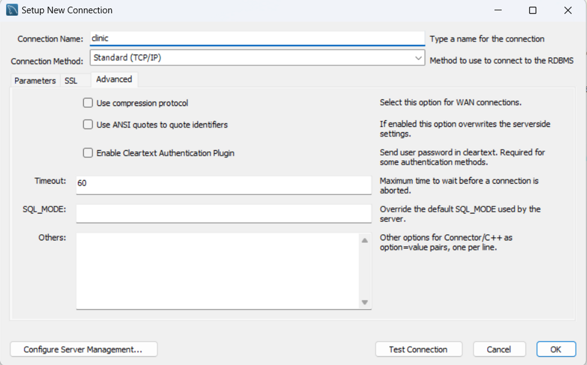
</p>

- Step 4: Right click the connection and select "Edit Connection..."

<p align="center">
  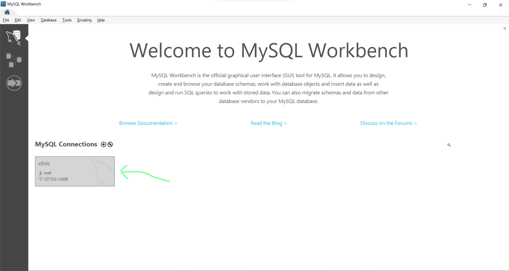
</p>

- Step 5: Select "Advanced" tab and add this line

```lang-non
  OPT_LOCAL_INFILE=1
```

<p align="center">
  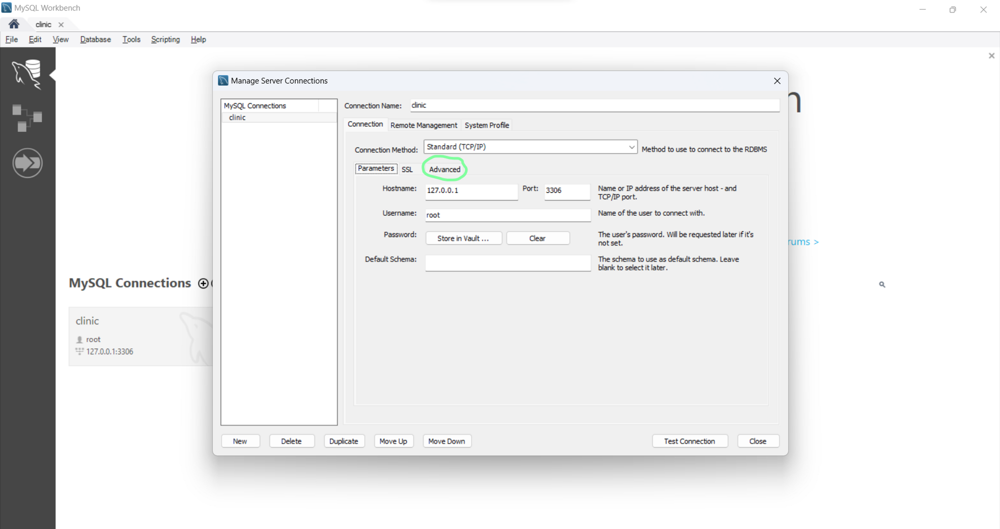
  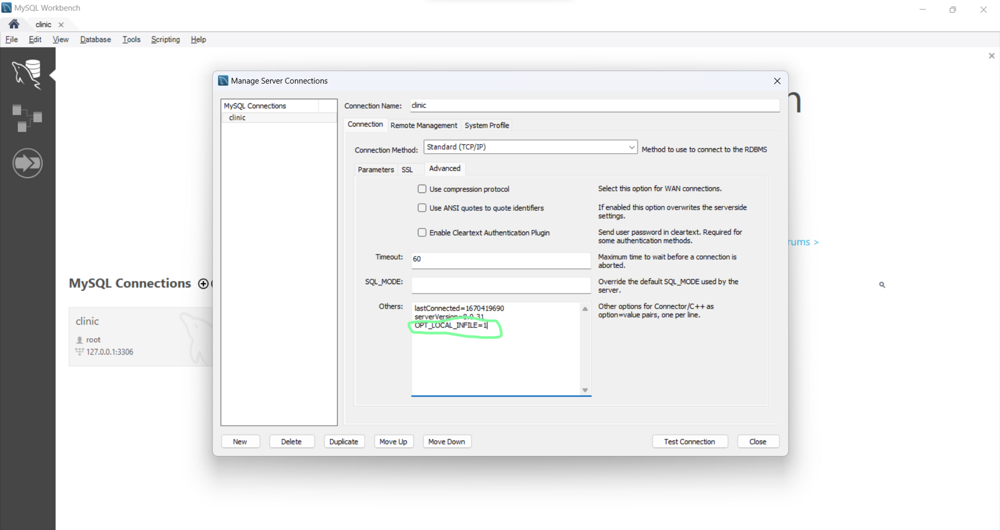
</p>

- Step 6: Select the connection that you have created and run this query to enable local_infile

```lang-non
  SET GLOBAL local_infile = 1;
```

<p align="center">
  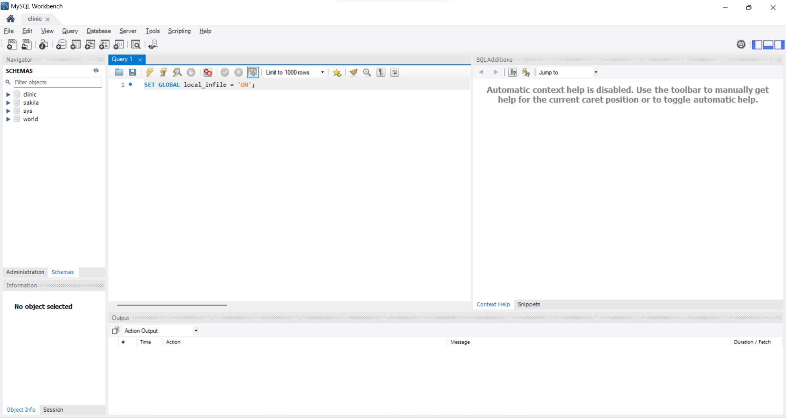 
</p>

- Step 7: Open “clinic_db.sql”
- Step 8: Change LOAD DATA LOCAL INFILE directory to match the location of your .csv and execute the query.

<p align="center">
  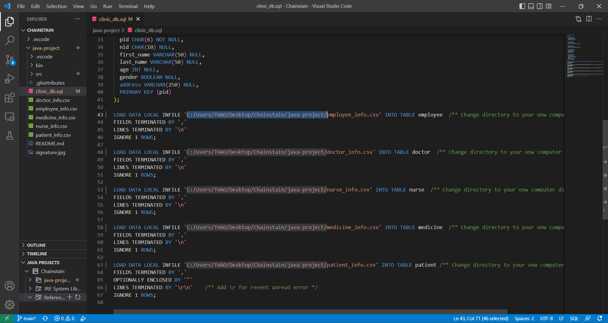
</p>

> *Note: You can use file explorer in Windows 10,11 to find your directory, this “ \ “ and this “/” are different*

- Step 9: Go to folder src/clinic/connection, open the “DBconnection” file, change the port, connection name, connection password to your, then save

<p align="center">
  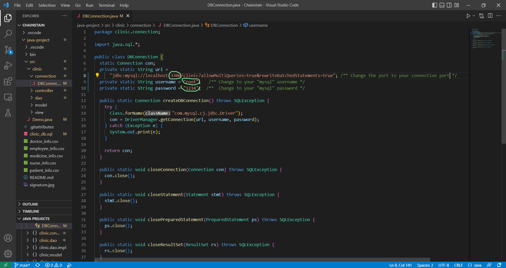
</p>

- Step 10: In the file explorer, click on "Java Projects", scroll down and click on "Referenced Libraries"

<p align="center">
  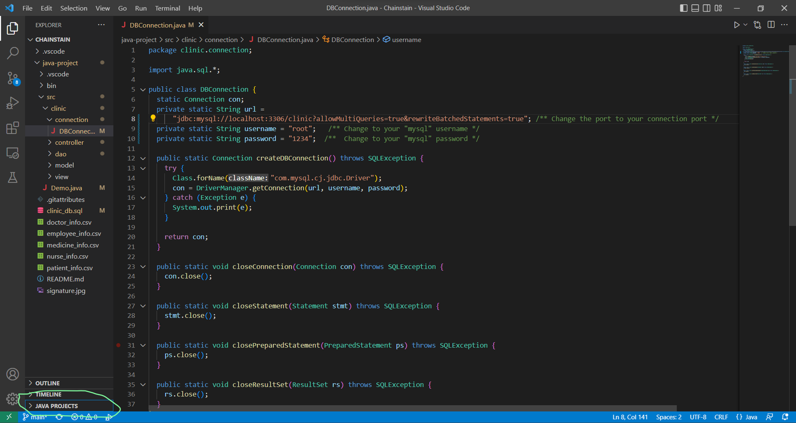
  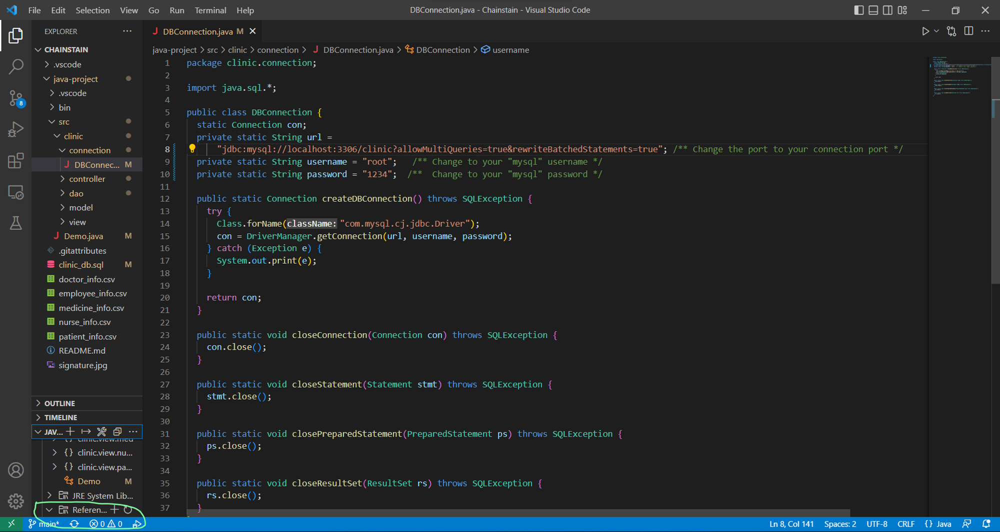
</p>

- Step 11: In "Referenced Libraries", click on plus sign button, then add “mysql-connector-j-8.0.31.jar” to the project(the file name may be diffrent depend on the version)

<p align="center">
  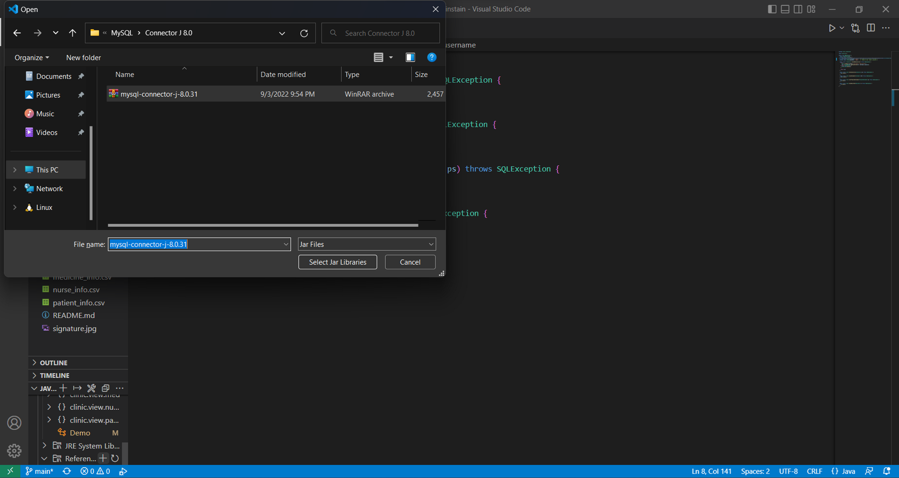
</p>

> *Note: You can find this file in folder Connect J 80 (or similar name) on your computer MySQL program files*

- Step 13: Finally you run Demo.java and the homepage will appear

<p align="center">
  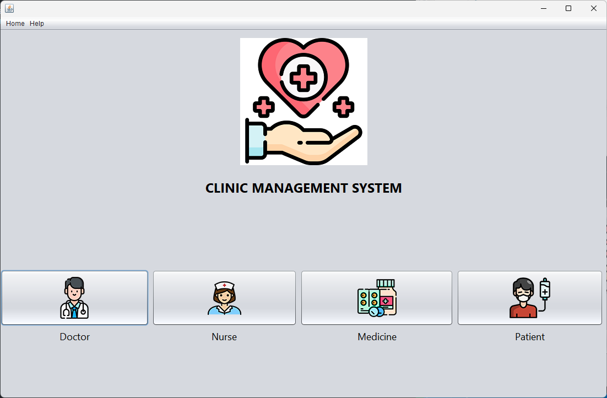
</p>
